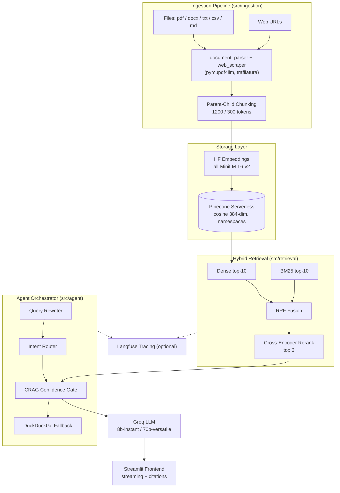
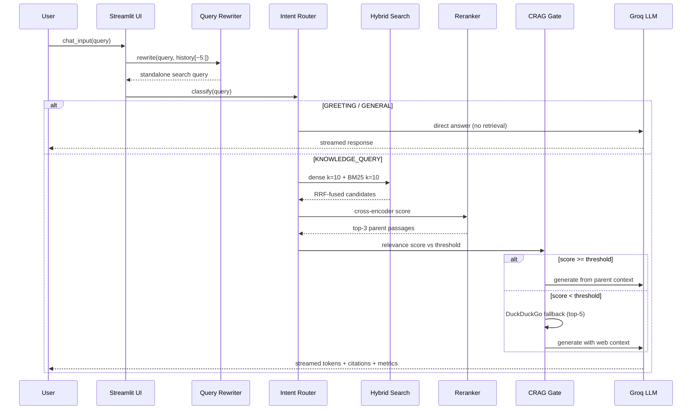

# System Architecture & Pipeline — RAG-Engine

## 1. Component Breakdown

| Layer | Module | Technology | Responsibility |
|---|---|---|---|
| Ingestion | `src/ingestion/` | `pymupdf4llm`, `python-docx`, `pandas`, `trafilatura` | Multi-format parsing, clean scraping, parent-child chunking, metadata tagging |
| Config | `src/config.py` | dataclasses + `.env`/Streamlit secrets | Single source of truth for all tunables |
| Vector storage | `src/retrieval/pinecone_client.py` | Pinecone serverless (cosine, 384-dim) | Namespaced index, batch upserts, stats; `ensure_index_exists` on boot |
| Embeddings | `hf_embeddings.py` | HF Inference API, `all-MiniLM-L6-v2` | Thread-pooled `embed_documents` with retry/backoff; `embed_query` |
| Hybrid retrieval | `src/retrieval/hybrid_search.py` | Dense + BM25 + RRF | $k=10$ dense, $k=10$ sparse, fused ranking |
| Reranker | `src/retrieval/reranker.py` | `BAAI/bge-reranker-base` (local or HF API) | Cross-encoder scoring → top 2–3, threshold 0.3 |
| Agent orchestrator | `src/agent/` | Groq `llama-3.1-8b-instant` | Rewrite → route → retrieve → rerank → CRAG gate → generate |
| LLM inference | Groq via `langchain-groq` | `llama-3.1-8b-instant` / `llama-3.3-70b-versatile` | Streaming generation, rewrite, intent, CRAG judging |
| Web fallback | `src/agent/crag.py` | `duckduckgo-search` | 5-result fallback when confidence is low |
| Observability | `src/observability/` | Langfuse (toggled) | Traces, generations, retrieval spans |
| Frontend | `src/ui/`, `main.py` | Streamlit | Streaming chat, citations, sidebar ops |

## 2. Hierarchical Chunking Strategy

`RecursiveCharacterTextSplitter` with markdown-aware separators (`\n## `, `\n### `, `\n\n`, `\n`, `" "`, `""`):

| Tier | Size | Overlap | Role |
|---|---|---|---|
| **Child** | 200–300 tokens | 50 | Embedded and indexed in Pinecone — small units maximize semantic precision |
| **Parent** | 1000–1200 tokens | 200 | Generation context — retrieved via `parent_id` join, fed to Groq for rich synthesis |

Each parent gets a UUID; children carry `parent_id`, `child_id`, `child_index`. Upload flattens children (`prepare_for_pinecone_upload`) with full parent metadata attached, so a child hit recovers its parent passage without a second store. Tune via `CHILD_CHUNK_SIZE / PARENT_CHUNK_SIZE` in `.env`.

## 3. Hybrid Retrieval & Reranker Algorithm

**Step 1 — Dense:** embed query (384-dim), Pinecone cosine top-$k_d=10$ in namespace.

**Step 2 — Sparse:** BM25 (`rank-bm25`) over indexed corpus, top-$k_s=10$:
$\mathrm{BM25}(q,d)$ with standard $k_1/b$ saturation and IDF weighting.

**Step 3 — RRF fusion** ($k=60$):
$$\mathrm{RRF}(d) = \frac{1}{60 + \mathrm{rank}_{\mathrm{dense}}(d)} + \frac{1}{60 + \mathrm{rank}_{\mathrm{sparse}}(d)}$$
Missing ranks back off to list length + 1. Sort descending → $k=10 \rightarrow$ rerank pool.

**Step 4 — Cross-encoder rerank:** each `(query, candidate)` pair scored jointly by `BAAI/bge-reranker-base` (richer than bi-encoder cosine since query and passage attend to each other). Filter at `RERANKER_THRESHOLD=0.3`, keep `FINAL_TOP_K=3` parent passages for generation.

## 4. High-Level Architecture (Mermaid)

## 5. Request–Response Sequence (Mermaid)

