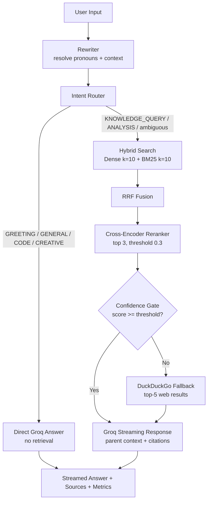

# Agent Instructions & Autonomous Logic — RAG-Engine

Orchestrator: `src/agent/pipeline.py::AgenticRAGPipeline.process`. Every incoming message flows through **rewrite → route → retrieve → rerank → gate → generate**, with latency and confidence recorded in `AgentResponse.metadata`.

## 1. Agent Roles & Execution Lifecycle

| Step        | Component                                          | Input → Output                                                                                         |
| ----------- | -------------------------------------------------- | ------------------------------------------------------------------------------------------------------ |
| 1. Rewrite  | `QueryRewriter` (`llama-3.1-8b-instant`, temp 0.0) | `(query, last 5 turns)` → `RewrittenQuery{rewritten_query, confidence}`. Skipped when history is empty |
| 2. Route    | `IntentRouter`                                     | `(rewritten query, last 3 turns)` → `IntentResult{intent, confidence, should_retrieve}`                |
| 3. Retrieve | `HybridSearcher.search`                            | Dense $k=10$ + BM25 $k=10$ → RRF-fused `SearchResult[]`                                                |
| 4. Rerank   | `CrossEncoderReranker.rerank`                      | Candidates → top-3 `RerankResult[]` at threshold 0.3                                                   |
| 5. Gate     | `CRAGPipeline.process`                             | LLM relevance score vs `CRAG_CONFIDENCE_THRESHOLD` (default 0.3) → docs answer or web fallback         |
| 6. Generate | Groq (streaming)                                   | Parent passages → streamed answer + `📚 sources` + `⚡ metrics`                                        |

Non-retrieval intents short-circuit at step 2 (`_answer_directly`).

## 2. Intent Router Decision Matrix

| Intent                         | `should_retrieve` | Condition / examples                                                                                            |
| ------------------------------ | ----------------- | --------------------------------------------------------------------------------------------------------------- |
| `GREETING`                     | No                | Fast regex hit (`hi`, `thanks`, `bye`, `how are you`) → canned or light LLM reply                               |
| `GENERAL`                      | No                | Chit-chat, opinions — no factual lookup needed                                                                  |
| `KNOWLEDGE_QUERY`              | **Yes**           | Specs, facts, docs, how-tos ("What is the RX 7900 XTX memory bandwidth?")                                       |
| `ANALYSIS`                     | **Yes**           | Comparisons, reasoning over retrieved content                                                                   |
| `CODE` / `CREATIVE`            | No                | Direct LLM with role system prompt                                                                              |
| **Ambiguous / low confidence** | **Yes**           | Router defaults to `KNOWLEDGE_QUERY` (0.5) — retrieval is the safe default; CRAG gate catches misses downstream |

## 3. Query Rewriting Logic

System prompt (`query_rewriter.py::SYSTEM_PROMPT`) enforces: resolve pronouns/references from history, expand abbreviations, preserve intent, output **only** the rewritten query.

```
History: "Tell me about AMD Radeon 7900 XTX" → Current: "What are its specs?"
→ Rewritten: "What are the specifications of AMD Radeon RX 7900 XTX?"

History: "How does DirectML work?" → Current: "Can I use it with ONNX?"
→ Rewritten: "Can ONNX Runtime be used with Microsoft DirectML?"
```

Confidence heuristic: 1.0 when unchanged, else word-overlap + expansion blend. Rewrite failures fall back to the original query (never block the pipeline).

## 4. Corrective Gating (CRAG)

`CRAGPipeline.evaluate_relevance` asks an LLM judge to score retrieved docs 0.0–1.0:

- **1.0** directly/comprehensively answers · **0.7–0.9** minor gaps · **0.4–0.6** significant gaps · **0.1–0.3** mostly noise · **0.0** irrelevant.
- **Score ≥ threshold (default 0.3):** `generate_answer` — context-only, `[Source: title]` citations, admits gaps rather than inventing.
- **Score < threshold:** `generate_web_fallback` — DuckDuckGo top-5 (`WEB_SEARCH_MAX_RESULTS`), answer prefixed as general knowledge; if web search also fails, explicit "I don't have enough information."
- Toggle via `WEB_FALLBACK_ENABLED`; empty retrieval scores 0.0 and goes straight to fallback.

Tuning guidance: raise toward 0.5–0.65 for high-stakes corpora (fewer hallucinations, more fallbacks); lower toward 0.2 for broad exploratory search. The shipped default (0.3) favors answering from noisy-but-useful docs.

## 5. End-to-End Workflow (Mermaid)


